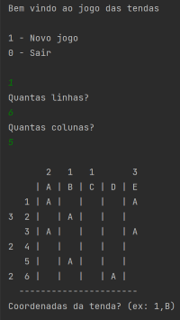

# Tent Game
Welcome to the Tent Game!

This project was proposed as the final assignment for the Fundamentals of Programming course.

## Rules
Here are some important rules to follow:

1. A tent "T" can only be placed around a tree "A".
2. A tent "T" cannot be placed next to another tent "T".
3. The objective of the game is to place all the tents on the respective board.
   1. Follow the vertical and horizontal legends indicating the number of tents "T" per row and column.
4. Upon winning, you will receive a congratulatory message and you can start another game.

## Features
This project includes some interesting features such as:

1. Various game board sizes: 6x5 ; 6x6 ; 8x8 ; 8x10 ; 10x8 ; 10x10.
   1. For the 10x10 game board, there is an age verification process due to the difficulty level.
2. Functionality to remove a tent: if a mistake is made and you wish to remove a wrongly placed tent, you can do so by entering its coordinates.
3. Exiting the game: simply enter the command "sair" to exit the game.

## Demonstration

Watch the demonstration video [here](https://youtu.be/N6T5Xi_F9cQ).

## How to Use
Prerequisites:

1. Java 19.
2. IntelliJ IDEA.

To use this project, follow these steps:

1. Step 1: Download the project.
2. Step 2: Open the project in IntelliJ IDEA.
3. Step 3: Run Main.kt.
4. Step 4: Enjoy.

## Créditos
###### UNIVERSIDADE LUSÓFONA DE HUMANIDADES E TECNOLOGIA ; 22/23

This project was developed by Rodrigo Dias (a22205897) and Rui Ferreira (a22207191).

As part of the Fundamentals of Programming course.